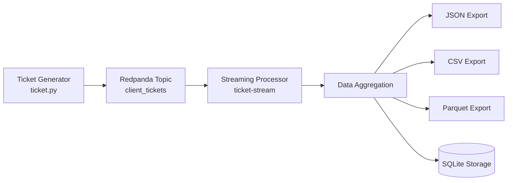

# Modélisez une infrastructure de traitement de données avec Redpanda et PySpark

## 👤 Auteur

Projet réalisé par **Noel Emmanuel**

* GitHub : https://github.com/Noel974
* LinkedIn : https://www.linkedin.com/in/Antoine-Noel/
* Email : [noelantoine974@outlook.fr](mailto:noelantoine974@outlook.fr)

---

# 📋 Sommaire

* [Introduction](#introduction)
* [Technologies utilisées](#technologies-utilisées)
* [Prérequis](#prérequis)
* [Installation de Redpanda avec Docker](#installation-de-redpanda-avec-docker)
* [Création du topic](#création-du-topic)
* [Génération de tickets](#génération-de-tickets)
* [Vérification des messages](#vérification-des-messages)
* [Installation de PySpark](#installation-de-pyspark)
* [Architecture du projet](#architecture-du-projet)
* [Video de démonstration](#vVideo-de-demonstration)

---

# Introduction

L'objectif de ce projet est de mettre en place un pipeline de données temps réel permettant :

* d'ingérer des tickets clients via Redpanda ;
* de diffuser les données dans un topic Kafka-compatible ;
* de traiter les données avec PySpark ;
* d'effectuer des analyses et des agrégations sur les tickets ;
* de stocker les résultats dans une base de données SQL.

Le projet simule un système de gestion de tickets clients afin d'analyser les demandes en temps réel.

---

# Technologies utilisées

* Python 3
* PySpark
* Redpanda
* Docker
* SQLite
* SQLiteStudio

---

# Prérequis

Avant de commencer, assurez-vous d'avoir installé :

* Docker Desktop
* Python 3.x
* Java (nécessaire pour Spark)
* SQLiteStudio (facultatif mais recommandé)

Vérification :

```bash
python --version
docker --version
java -version
```

---

# Installation de Redpanda avec Docker

Créer un fichier :

```text
docker-compose.yml
```

Puis démarrer le conteneur :

```bash
docker compose up -d
```

Vérifier que Redpanda fonctionne correctement :

```bash
docker exec -it redpanda rpk cluster info
```

Résultat attendu :

```text
CLUSTER
=======
redpanda.xxxxxxxx

BROKERS
=======
ID    HOST       PORT
0*    127.0.0.1  9092
```

Si ces informations apparaissent, Redpanda est opérationnel.

---

# Création du topic

Créer le topic qui recevra les tickets :

```bash
docker exec -it redpanda rpk topic create client_tickets
```

Lister les topics existants :

```bash
docker exec -it redpanda rpk topic list
```

Résultat attendu :

```text
NAME            PARTITIONS  REPLICAS
client_tickets  1           1
```

---

# Génération de tickets

Lancer le producteur Python :

```bash
python ticket.py
```

Exemple de sortie :

```text
📤 Envoi de tickets dans Redpanda... (Ctrl+C pour arrêter)

✅ Ticket envoyé dans client_tickets
✅ Ticket envoyé dans client_tickets
✅ Ticket envoyé dans client_tickets
✅ Ticket envoyé dans client_tickets
...

🛑 Producteur arrêté.
```

Le script génère automatiquement des tickets clients au format JSON et les envoie dans le topic `client_tickets`.

---

# Vérification des messages

Pour consulter les messages stockés dans Redpanda :

```bash
docker exec -it redpanda rpk topic consume client_tickets
```

Exemple de message :

```json
{
  "topic": "client_tickets",
  "value": "{\"ticket_id\":2989,\"client_id\":89,\"datetime_creation\":\"2026-06-03T10:50:37.586515\",\"demande\":\"Impossible de se connecter\",\"type_demande\":\"Problème technique\",\"priorite\":\"Critique\"}",
  "partition": 0,
  "offset": 0
}
```

Chaque ticket contient :

* ticket_id
* client_id
* datetime_creation
* demande
* type_demande
* priorite

---

# Installation de PySpark

Installer PySpark :

```bash
pip install pyspark
```

Vérifier l'installation :

```bash
pyspark --version
```

---

# Base de données

Pour stocker les résultats des analyses, SQLite est utilisée.

Télécharger SQLiteStudio :

https://sqlitestudio.pl/

Créer une base de données :

```text
tickets.db
```

Les résultats des traitements Spark peuvent ensuite être enregistrés dans cette base.
# ⚙️ Configuration Spark 3.5.8 + PySpark 3.5.1 (Windows)

Cette section décrit l’installation complète de Spark et PySpark sur Windows, ainsi que la configuration nécessaire pour exécuter des scripts Spark dans un environnement virtuel Python.

---

## 🧩 1. Installation de Spark 3.5.8

### 📥 Télécharger Spark
Télécharger Spark 3.5.8 (prébuild Hadoop 3) depuis le site officiel Apache Spark.

Décompresser l’archive dans un dossier, par exemple :

configurration pyspark 
PYSPARK_PYTHON = python
PYSPARK_DRIVER_PYTHON = python

---

# Architecture du projet

```text
+----------------+
| ticket.py      |
| Producteur     |
+--------+-------+
         |
         v
+----------------+
| Redpanda       |
| client_tickets |
+--------+-------+
         |
         v
+----------------+
| PySpark        |
| Traitements    |
| Agrégations    |
+--------+-------+
         |
         v
+----------------+
| SQLite         |
| Stockage       |
+----------------+
```

---

## Fonctionnalités

* Génération automatique de tickets clients
* Streaming temps réel avec Redpanda
* Lecture des données avec PySpark
* Analyse des tickets
* Agrégation par type de demande
* Attribution d'équipes de support
* Stockage des résultats dans SQLite


---

# Video demonstration 
Video qui explique le deroulement de la pipeline ETL avec test d'analyse de la base de donnée via sqllite lien de la video `https://youtu.be/SwyGCAomZ8I`